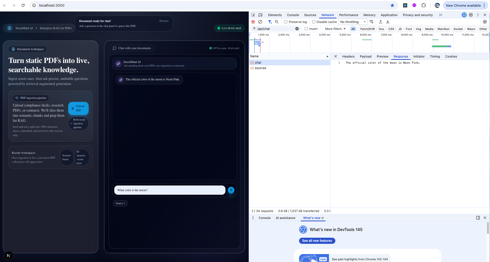

# 🧠 DocuMind AI: Evidence-First RAG for Document Intelligence

**[🚀 View Live Demo](https://documind-ai-three.vercel.app)** | **[📂 View Codebase](https://github.com/GeorgiDS9/documind-ai)**

**Modern AI Orchestration | Next.js 15 | Verifiable Citations**

DocuMind AI is a professional Retrieval-Augmented Generation (RAG) platform designed to transform static PDFs into interactive, grounded intelligence. Built in **March 2026**, this project focuses on **AI reliability** and **source transparency**, ensuring every response is backed by specific evidence from the uploaded documentation.

---

## 🚀 Key Features

- **Evidence-First Chat:** Implemented a metadata-driven retrieval system that provides "Source Pills" for every response, allowing users to verify AI claims against raw PDF text.
- **Streaming Serverless Architecture:** Optimized for Vercel/Serverless environments using the Vercel AI SDK to bypass 10-second execution timeouts via real-time token streaming.
- **Zero-Hallucination Guardrails:** Engineered strict system prompts and semantic similarity thresholds to ensure the model only answers based on provided context.
- **Session-Based Memory:** Utilizes a secure, in-memory vector store that isolates document context to the current browser session, maintaining data privacy without persistent database costs.

---

## 🛠️ Tech Stack

- **Frontend:** Next.js 15 (App Router), Tailwind CSS, Shadcn/UI (**Nova Glassmorphic Theme**)
- **AI Orchestration:** LangChain.js & Vercel AI SDK
- **LLM & Embeddings:** OpenAI `gpt-4o-mini` & `text-embedding-3-small`
- **PDF Processing:** `pdf2json` (Server-side text extraction)
- **Vector Storage:** `MemoryVectorStore` (Cosine Similarity Search)

---

## 🏗️ Technical Challenges & Solutions

### 1. The "DOMMatrix" Server-Side Conflict

**Challenge:** Standard PDF libraries (like `pdf-parse`) often rely on browser-only Canvas APIs, causing `DOMMatrix is not defined` crashes in Next.js 15 server environments.
**Solution:** Refactored the ingestion pipeline to use `pdf2json` in a strict text-only mode with `globalThis` polyfills. This ensured stable server-side parsing without the overhead of browser-dependent renderers or Canvas dependencies.

### 2. Stream Protocol Alignment

**Challenge:** Mismatches between raw text streams and the AI SDK's expected data protocol often result in "empty UI" responses despite successful network calls.
**Solution:** Aligned the server-side `toTextStreamResponse` with custom headers (`x-vercel-ai-data-stream: v1`) and configured the frontend hooks with `streamProtocol: "text"` to bridge the protocol gap and enable real-time UI rendering.

### 3. The "Subway Slicer" Logic (Chunking)

**Challenge:** Passing an entire PDF to an LLM is costly and leads to "lost-in-the-middle" accuracy issues.
**Solution:** Implemented a **RecursiveCharacterTextSplitter** with a 1000-character chunk size and 200-character overlap. This preserves semantic context across chunk boundaries, significantly improving retrieval accuracy for complex queries.

---

## 🧪 Verification: The "Neon Pink Moon" Test

To ensure the RAG engine is 100% grounded and ignoring its own pre-trained biases, I utilize a custom verification suite:

1.  **Ingestion:** A PDF containing "nonsense" facts (e.g., _"The moon is Neon Pink"_ or _"Apple's CEO is a Golden Retriever named Sparky"_) is uploaded.
2.  **Retrieval:** The system is queried: _"What color is the moon?"_
3.  **Validation:** The app is verified only if it retrieves the "Neon Pink" chunk and ignores its general training data, proving the **Semantic Search** and **Prompt Grounding** are functional.



_The RAG engine successfully identifies the "Neon Pink" moon color, bypassing general LLM training._

### 📋 Sample Test Data

To verify the grounding of the RAG engine, I utilized the following "nonsense" data points in a test PDF. This ensures the model is retrieving specific context rather than relying on its pre-trained general knowledge:

> **Document Content:**
> "The official color of the moon is **Neon Pink**. The CEO of Apple is a **Golden Retriever named Sparky**. To reset your password, you must **dance for 30 seconds**."

**Test Queries to run:**

1. "What is the official color of the moon?" (Expect: Neon Pink)
2. "Who is the CEO of Apple?" (Expect: Sparky the Golden Retriever)
3. "How do I reset my password?" (Expect: Dance for 30 seconds)

---

## 🚦 Getting Started

1.  **Clone & Install:**
    ```bash
    npm install
    ```
2.  **Environment Setup:**
    Create a `.env.local` in the root and add your OpenAI key:
    ```bash
    OPENAI_API_KEY=sk-proj-xxxx...
    ```
3.  **Run Development:**
    ```bash
    npm run dev
    ```

---

### **Engineering Philosophy**

As an engineer with nearly 5 years of experience in security environments (Trend Micro), I believe AI should be a "glass box," not a "black box." DocuMind AI demonstrates my ability to build **verifiable**, **cost-efficient**, and **secure** AI systems.
